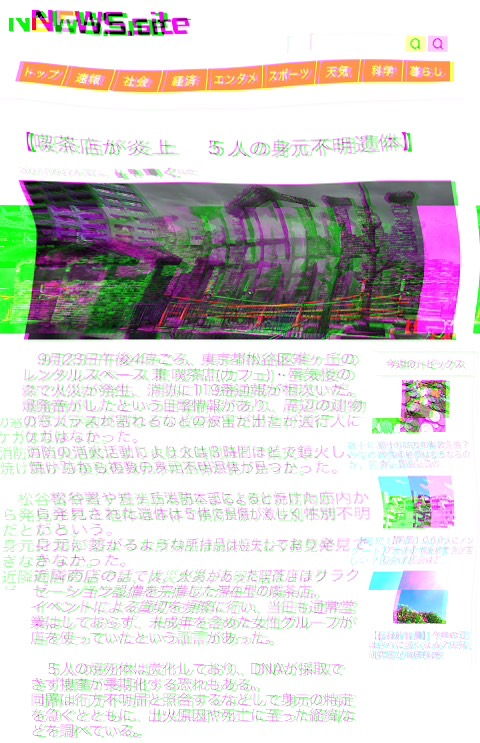
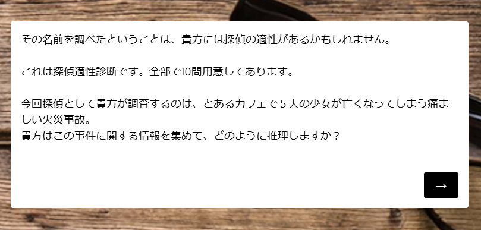
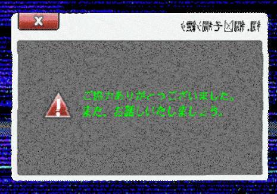

import { TwitterTweetEmbed } from "react-twitter-embed";
import AccordionBox from '../../../components/accordionBox';


## 2025-03-10

およそ1年ぶりにイオリ・ハートフィールドのX（Twitter）アカウントが動き、以下のポストが行われた。  
"case.683"という、これまでに報告されていなかったcase番号に関する情報であり、事件の名称は未定（[TBD](https://eow.alc.co.jp/search?q=to+be+determined&ref=wl)）とされている。

<TwitterTweetEmbed
  tweetId={'1899052613582160181'}
/>

> (DeepLによる和訳)  
> 遅ればせながら、case.683の報告である。
> 融解事件の影響：673、「クロノ・イナーシャ」がより強力な力でこの世界を襲っている。
> 彼女たちを救うため、私たちは 「パストハッキング 」を試みたが、すべて失敗に終わった。
> 知恵を絞り、高いハードルを越えるという従来のやり方では、この事件は解決しない。
> 人間の心ほど不可解なものはない。

これを受けて融解班（プレイヤー）たちはDiscordに集結した。しかし、`bit.ly` が短縮URLであるとは判断できたものの、 `Location` `Reference` などをどう用いるのか苦戦し、残念ながらこの日に大きな進捗はなかった。

## 2025-03-12

10日と同様に、イオリがXに投稿を行った。今回も似たようなフォーマットだが、文字化けした文字列で補足が行われた。

<TwitterTweetEmbed
  tweetId={'1899777394820407298'}
/>

> (DeepLによる和訳)  
> これを自分で処理するのは不可能なので、「WIZARD」を使うことにした。  
> これで中盤にアクセスできるようになり、「銀の弾丸」のリーチが1年延びた。  
> 同時に、適合者へのアクセスも開始した。2024年現在、「WIZARD」を使えるのは???だけである。

[文字化けテスター](https://tools.m-bsys.com/dev_tools/char_corruption.php)などを使うと、これは以下のように読める。

> 前回はすまな????不完??で生??方法も記載して????かった???全てを繋げてURLを作ってくれ
> （前回はすまなかった　不完全で生成方法も記載していなかった　全てを繋げてURLを作ってくれ）

これより、融解班は以下のURLを導き出した。

```
3/10の投稿: https://bit.ly/_6x932xx4S109x617ExxShinkiro_newsonlyAAnothing
3/12の投稿: https://bit.ly/5x14yxx8S118x350ExxWHEonlyAAnothing
```

3/10のURLからは以下のような歪んだニュース記事の画像が得られた。



> 【喫茶店が炎上 5人の身元不明遺体】
>9月23日午後4時ごろ、東京都松谷区雉ヶ丘のレンタルスペース 兼 喫茶店（カフェ）・蜃気楼の森で火災が発生、消防に119番通報が相次いだ。
>爆発音がしたという目撃情報があり、周辺の建物の窓ガラスが割れるなどの被害が出たが通行人にケガはなかった。
>消防の消火活動により火は3時間ほどで鎮火し、焼け跡から複数の身元不明遺体が見つかった。
>
>松谷署や雉ヶ丘消防本部によると焼けた店内から発見された遺体は5体で損傷が激しく性別不明だという。
>身元に繋がるような所持品は消失しており発見できなかった。
>近隣の店の話では、火災があった喫茶店はリラクゼーション設備を完備した滞在型の喫茶店。
>イベントによる貸切を頻繁に行い、当日も通常営業はしておらず、未成年を含めた女性グループが店を使っていたという証言があった。
>
>5人の焼死体は炭化しており、DNAが採取できず操作が長期間する恐れもある。
>同署は行方不明届けと照合するなどして身元の特定を急ぐとともに、出火原因や死亡に至った経緯などを調べている。


3/12のURLからは `WHE.zip` というZIPファイルが得られた。中にはアルター・ガールズの3Dモデルと思われるシルエット画像が得られた。  
→[ファイルの調査結果はこちら](./0310/WHE_and_shindan)

### 多摩希美子と診断サイト

ニュース記事では、2024年9月に **蜃気楼の森** というレンタルスペース兼カフェで火災が発生し、5人が死亡したことが書かれている。この `蜃気楼の森` をXで検索した融解班によって、フリージャーナリスト **多摩希美子** の投稿が発見された。投稿によると、多摩希美子は墨田の同級生である（[X](https://x.com/tamako_flyer/status/1867561862780289275)）。

<TwitterTweetEmbed
  tweetId={'1864968021011296324'}
/>

多摩希美子の投稿によれば、みやまん関連の掲示板やDiscordに「同じURLが貼られて」いるという。

<TwitterTweetEmbed
  tweetId={'1868298717784363338'}
/>

<TwitterTweetEmbed
  tweetId={'1868597436677030340'}
/>

このURLからはよくある診断サイトに飛ぶのだが、アルターガールズの名前を入力すると、「蜃気楼の森」の火災に関する情報が表示されるようになる。

<TwitterTweetEmbed
  tweetId={'1868597436677030340'}
/>

また、多摩希美子は「 **[おーじたかし](https://x.com/ccxeG5rwWt56761)** 」というユーザをフォローしており、このユーザも同じ診断サイトにアクセスしたことを投稿している。

<TwitterTweetEmbed
  tweetId={'1896886842882163044'}
/>

### 名前診断！あなたの転生先はずばりココ！（探偵適性診断）

上記のサイトは、文字列を入力すると普通の「診断メーカー」的なサイトとして機能する。しかし、アルターガールズの名前を入力すると、別のURLに転送され、以下のメッセージが表示される。




この「探偵適性診断」では、アルターガールズのプロフィールに関する質問が行われる。

<AccordionBox title="▼各問題の答え一覧（クリックして表示）">
- 1. 裁縫
- 2. 思う
- 3. キューティキャット
- 4. 思う
- 5. 藤色（一番上）
- 6. 思う
- 7. グミ
- 8. 思う
- 9. みぃ
- 10. 思う

また、問題中に登場したアルターガールズの画像をクリックすることで、QRコードが1枚ずつ得られる（キューティキャットの画像はハズレ）。
それを並び替えることで `cornered rat`（[袋のネズミ](https://eow.alc.co.jp/search?q=cornered+rat)）という言葉が得られる。

- チャレンジ問題: cornered rat

これに正解すると、さらに別のサイトに転送される。

- この声が誰のものかわかりますよね？→はい
- あなたは「蜃気楼の森火災事故」の犯人ですか？→ はい


</AccordionBox>

全問正解すると、ノイズ混じりの別サイトに転送され、以下のようなメッセージが表示される。

