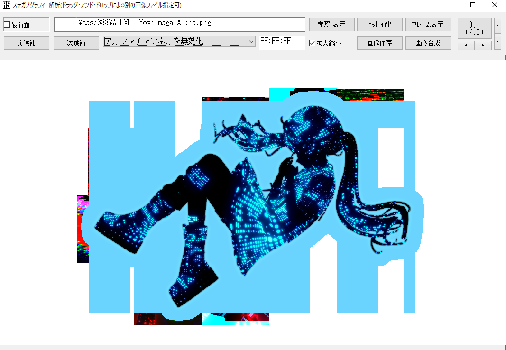

import AccordionBox from '../../../../components/accordionBox';

# WHE.zipと探偵適性診断の分析

このページでは、得られたファイルなどの分析結果を示す。  
なお、以下のデータ解析はすべて公開情報から得られたものであり、いわゆる「（現実世界における）ハッキング」は一切含まれないため、安心してほしい。

## WHE

3月12日の投稿から得られた ["WHE" というZIPファイル](https://bit.ly/5x14yxx8S118x350ExxWHEonlyAAnothing) には、5枚のPNGファイルが含まれていた。ファイル名は以下の通りで、それぞれ3DCGでレンダリングされたアルターガールズのシルエットの透過画像である。

```
HE_Hanasaki_Alpha.png
HE_Kazahari_Alpha.png
HE_Kusakabe_Alpha.png
HE_Sumida_Alpha.png
HE_Yoshinaga_Alpha.png
```

いずれも8Kサイズの透過PNGサイズであり、画像データとしてはやや大きい。以下にExiftoolの実行結果を示すが、Photoshop上で作成された痕跡がある以外、5枚とも有用なメタデータは得られなかった。

<AccordionBox title="▼HE_Yoshinaga_Alpha.pngのExiftool実行結果（クリックして表示）">
```
> exiftool .\HE_Yoshinaga_Alpha.png
ExifTool Version Number         : 13.19
File Name                       : HE_Yoshinaga_Alpha.png
Directory                       : .
File Size                       : 7.8 MB
Zone Identifier                 : Exists
File Modification Date/Time     : 2025:03:14 01:01:04+09:00
File Access Date/Time           : 2025:03:15 13:56:27+09:00
File Creation Date/Time         : 2025:03:12 11:09:08+09:00
File Permissions                : -rw-rw-rw-
File Type                       : PNG
File Type Extension             : png
MIME Type                       : image/png
Image Width                     : 7680
Image Height                    : 4320
Bit Depth                       : 8
Color Type                      : RGB with Alpha
Compression                     : Deflate/Inflate
Filter                          : Adaptive
Interlace                       : Noninterlaced
Profile Name                    : ICC profile
Profile CMM Type                : Linotronic
Profile Version                 : 2.1.0
Profile Class                   : Display Device Profile
Color Space Data                : RGB
Profile Connection Space        : XYZ
Profile Date Time               : 1998:02:09 06:49:00
Profile File Signature          : acsp
Primary Platform                : Microsoft Corporation
CMM Flags                       : Not Embedded, Independent
Device Manufacturer             : Hewlett-Packard
Device Model                    : sRGB
Device Attributes               : Reflective, Glossy, Positive, Color
Rendering Intent                : Perceptual
Connection Space Illuminant     : 0.9642 1 0.82491
Profile Creator                 : Hewlett-Packard
Profile ID                      : 0
Profile Copyright               : Copyright (c) 1998 Hewlett-Packard Company
Profile Description             : sRGB IEC61966-2.1
Media White Point               : 0.95045 1 1.08905
Media Black Point               : 0 0 0
Red Matrix Column               : 0.43607 0.22249 0.01392
Green Matrix Column             : 0.38515 0.71687 0.09708
Blue Matrix Column              : 0.14307 0.06061 0.7141
Device Mfg Desc                 : IEC http://www.iec.ch
Device Model Desc               : IEC 61966-2.1 Default RGB colour space - sRGB
Viewing Cond Desc               : Reference Viewing Condition in IEC61966-2.1
Viewing Cond Illuminant         : 19.6445 20.3718 16.8089
Viewing Cond Surround           : 3.92889 4.07439 3.36179
Viewing Cond Illuminant Type    : D50
Luminance                       : 76.03647 80 87.12462
Measurement Observer            : CIE 1931
Measurement Backing             : 0 0 0
Measurement Geometry            : Unknown
Measurement Flare               : 0.999%
Measurement Illuminant          : D65
Technology                      : Cathode Ray Tube Display
Red Tone Reproduction Curve     : (Binary data 2060 bytes, use -b option to extract)
Green Tone Reproduction Curve   : (Binary data 2060 bytes, use -b option to extract)
Blue Tone Reproduction Curve    : (Binary data 2060 bytes, use -b option to extract)
Software                        : Adobe ImageReady
XMP Toolkit                     : Adobe XMP Core 9.1-c002 79.a6a63968a, 2024/03/06-11:52:05
Original Document ID            : xmp.did:8d032fec-5752-b546-a4be-7f1aadb63764
Document ID                     : xmp.did:D984B07E862311EFB744DA37FA2CE230
Instance ID                     : xmp.iid:D984B07D862311EFB744DA37FA2CE230
Creator Tool                    : Adobe Photoshop 25.11 (Windows)
Derived From Instance ID        : xmp.iid:28f28527-f8c1-b740-b90e-2db7e6cdd274
Derived From Document ID        : adobe:docid:photoshop:805d5697-2c6e-5646-b14d-e47b4fa3f533
Image Size                      : 7680x4320
Megapixels                      : 33.2
```
</AccordionBox>

ただし、画像のアルファチャンネルを無効化したとき、`HE_Yoshinaga_Alpha.png` のみ、背景に奇妙な模様が出ることが複数の融解班によって指摘されている。  
現時点ではこれから有用な情報を導き出すことはできておらず、意図的なものであるか否かも明らかになっていない（2025/03/15現在）。



## 探偵適性診断

### 診断

診断の結果をまとめたスプレッドシートは以下の通り。

- [蜃気楼の森　転生先内容](https://docs.google.com/spreadsheets/d/1OE0cSyNijAz4Odd2M0BscwbTiRzxWoxvpJQ0E3391CA/edit?gid=0#gid=0) (Amonさんによる管理)

### 画像・動画

探偵適性診断上に存在していた画像から、ステガノグラフィ解析を通じて有用な情報は見つかっていない（2025/03/15現在）。ただし、「あげおじ」の動画についてはメタデータ上に`上尾`という文字列が確認できるため、本名が「上尾」である可能性が浮上している。

DMの画像については、同じUIのSNSが見つかっていないことから、架空のものであると推定されている。