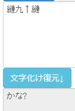

import { TwitterTweetEmbed } from "react-twitter-embed";
import YouTube from 'react-youtube';
import AccordionBox from '../../../components/accordionBox';


## 2025-03-14

<TwitterTweetEmbed
  tweetId={'1900502166801985860'}
/>

> (DeepLによる和訳)  
> 2024 年 11 月 22 日、ついに適合者へのアクセスに成功した。「レアエナジー」不足の中、PCでサウンドデータを流して一瞬注目を集めることしかできなかった。


3/10, 3/12の投稿と同様に、融解班は文字列をつなげてURLを導き出した。

```
https://bit.ly/1x726xx9S156x423ExxHE_voice_AlphaonlyAAnothing
```

すると、以下のYouTube動画が得られた。

<YouTube
  videoId={'ctTsder6OS0'}
/>

この動画には字幕が出るようになっており、以下の文字列が表示されていた。

```
I got this from 縺九↑縺 computer.
```

文字化けしている `縺九↑縺`の復元を試みると `かな?` となる。



文字化けの仕組み上、`?` には `あ` ～ `た` までの任意のひらがなが入り、文字化け前の文字列は一意に求められない。
融解班は人名 `かなえ` `かなこ` `かなた` などではないかと推測し、アカウントを探索したり、その日の前後で「パソコンから音が鳴った」という投稿を探し求めたり、音声データの解析（低速再生・逆再生・スペクトログラムによる可視化）を試みたりしたが、残念ながら有意な結果が得られず、これ以上の進展はなかった。

## 2025-03-16

イオリから以下の画像が投稿されるも、前回と違い、URLなどに繋がる情報はなかった。

<TwitterTweetEmbed
  tweetId={'1901226951865462797'}
/>

> (DeepLによる和訳)  
> 2024年12月21日、我々はついに計画を開始した。  
> ...そして、残念ながら失敗した。

画像自体から得られる情報もなく、融解班は進展なしで次の情報を待つことになった。
