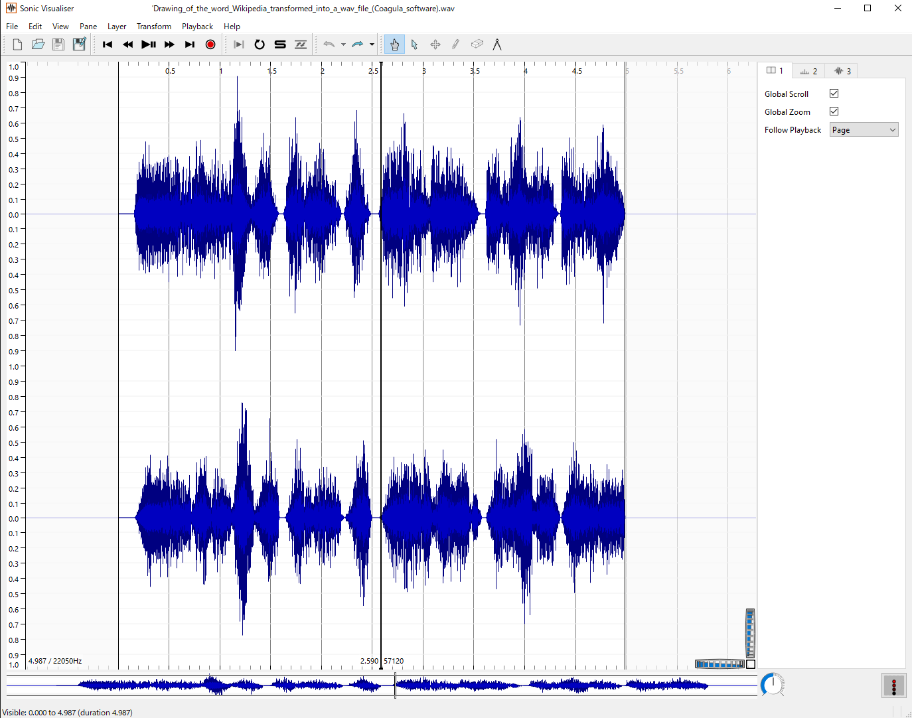
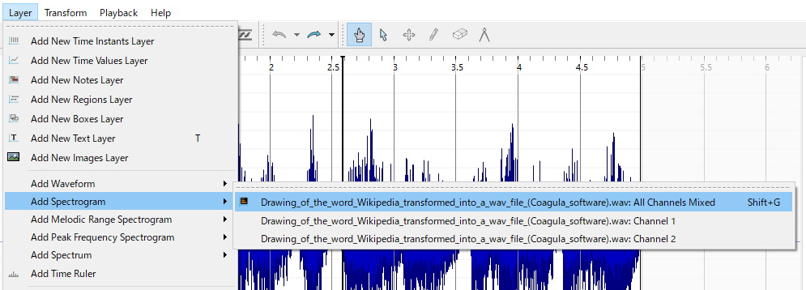
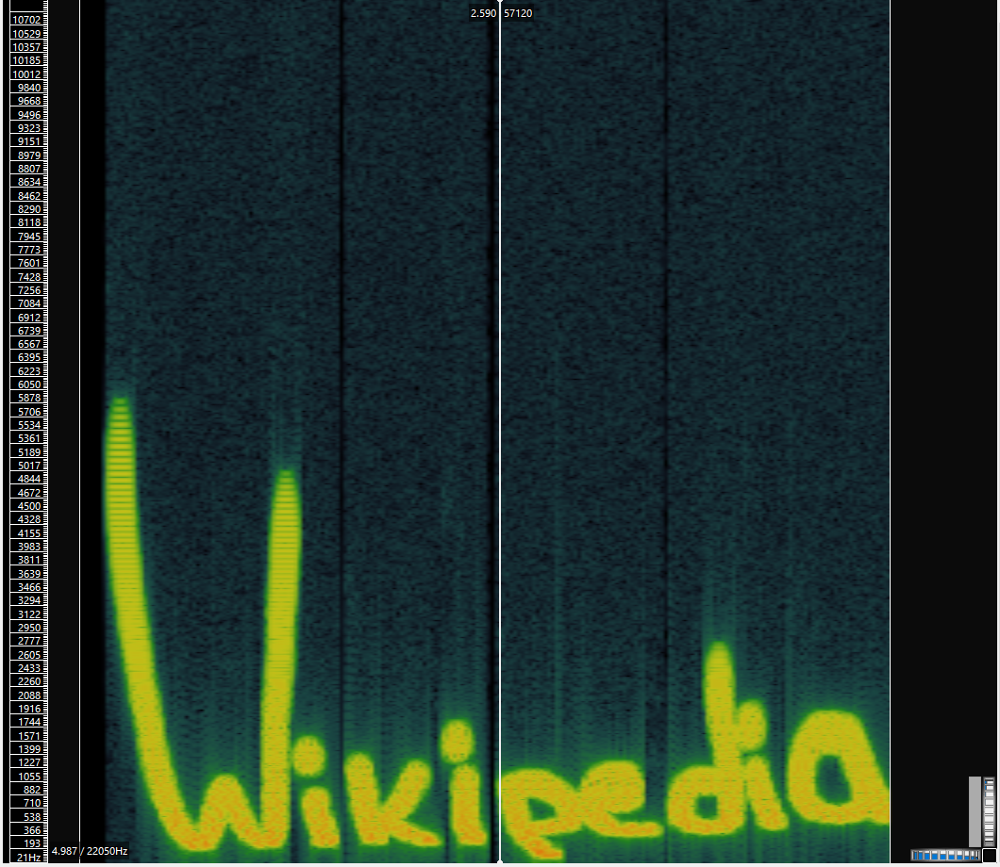

# 音声ステガノグラフィ

これまでに出題例はありませんが、音声データのステガノグラフィを仕込む手法があります。
与えられた音声データを普通に聴いてみて、単にノイズに聞こえるなど、情報が得られなさそうだったら解析を試してみるのも良いでしょう。

## ステガノグラフィ解析実習

Wikipediaに[音声データ](https://commons.wikimedia.org/wiki/File:Drawing_of_the_word_Wikipedia_transformed_into_a_wav_file_(Coagula_software).wav)の例があります（音量注意）。今回はこのデータを使います。

ダウンロードした音声ファイルをSonic Visualiserにドラッグアンドドロップして読み込むと、波形（waveform）が表示されます。マウスのホイールをスクロールすると拡大縮小できます。

Layer → Add Spectrogram → Drawing... をクリックします。

スペクトログラムが表示され、周波数成分として隠されていた文字が表示されます。

