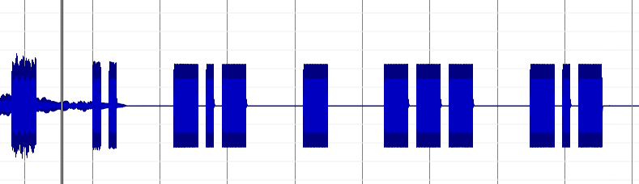
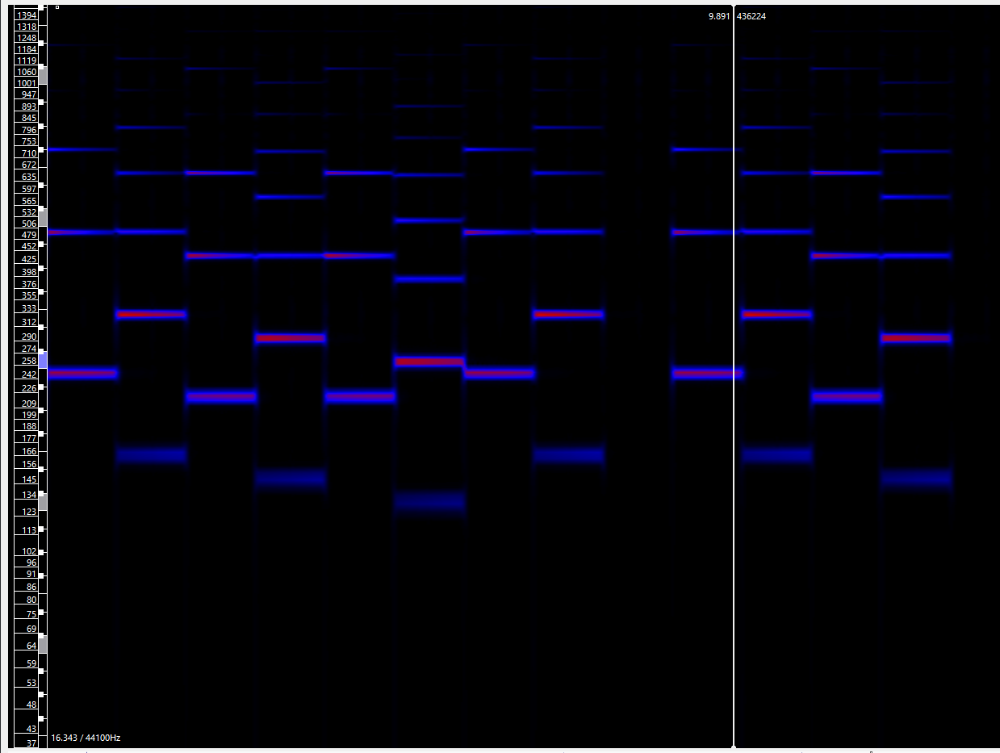

# 音声の可視化

音声データは、ツールを用いて可視化すると解きやすくなることがあります。

## 波形データの確認

音声データをSonic Visualiserにドラッグ・アンド・ドロップで読み込むと、波形データとして表示できます。動画ファイルもそのまま読み込むことができます。

音楽や声の録音であれば、波形から有用な結果は得られないのですが、信号などを可視化する際には非常に役立ちます。

実際の謎解きの問題を見てみましょう。
たとえば[Ds試験 第5問](https://x.com/daiyonkyokai/status/1862844040070467792)の動画では、後半にモールス信号が含まれていました。
音として聞き取ろうとすると慣れが必要ですが、波形として可視化すれば以下のように信号（長音、短音、空白）が非常に明瞭になります。



冒頭部分は音楽と重複しているので波形がやや見づらいですが、長音を `-`、短音を `.` と表すと

```
- .. -.- - --- -.-
```

となります。
これを[Morse Code Translator](https://morsecode.world/international/translator.html)といったサイトに入力すると、`TIKTOK` という文字列が得られます。
何度も音を聞き直すより、確認しやすいのではないでしょうか。

## 周波数の確認と音階への変換

音声データは周波数別の分析も可能です。音声ファイルをSonic Visualiserにドラッグアンドドロップして読み込み、Layer → Add Melodic Range Spectogram → Drawing... をクリックします。

すると、以下の画面のように周波数ごとに音が可視化されます。赤色で表示されているものが、強く鳴っている音です。



耳コピができなくても、これを基に音階を特定することが可能です。
音源によってブレやノイズはあると思いますが、[音階と周波数のデータ](https://tomari.org/main/java/oto.html)と、その音声データで鳴っている一番近い周波数を照らし合わせることにより、簡単な音階であれば知ることができます。

なお、スマホの場合はは[ボーカル音程モニター](https://play.google.com/store/apps/details?id=com.tadaoyamaoka.vocalpitchmonitor&hl=ja)を使うと良いようです。

## 音声の編集

分析において、一部を切り取るといった編集作業が必要になった場合、[Audacity](https://forest.watch.impress.co.jp/library/software/audacity/)のようなソフトウェアを使うと便利です。
