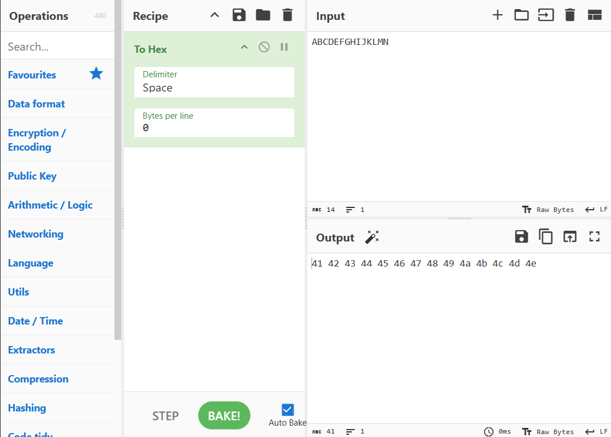
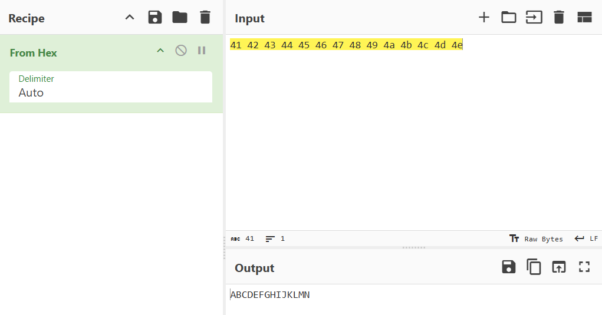

# 文字のエンコード・デコード

「エンコード」とは、コンピュータ上でデータを一定の規則に基づいて変換することです。エンコードしたものを元に戻すことが「デコード」です。

厳密な定義として、文字列のエンコードは「暗号」ではないのですが、謎解きの上では暗号に準じた扱いを受けることから、このカテゴリで解説します。

## 文字コード

### 文字を数値として表現する規格

文字を通信やコンピュータで扱うには、1文字ずつ番号（数値）を割り当てて処理する必要があります。文字と数値の対応関係の規格を**文字コード**といいます。

1963年に定義された[ASCII](https://ja.wikipedia.org/wiki/ASCII)（アスキー）コードがその代表例で、これは英語で使われるアルファベットや記号などを数値にしたものです。その後、様々な言語にいろいろな文字コードが登場しました。日本語であれば[Shift_JIS](https://ja.wikipedia.org/wiki/Shift_JIS)や[EUC-JP](https://ja.wikipedia.org/wiki/EUC-JP)などが有名です。

しかし、文字コードの間には互換性がありません。例えば、Shift_JISで書かれた文章を、EUC-JPとして読み取ろうとすると、数字と文字の対照関係が壊れてしまい、意味不明な文字列が表示されてしまいます。これが**文字化け**です。

日本語だけでも複数の文字コードがあるわけですから、世界各国の文字コードを取り扱う時にはさらに複雑になることが想像できると思います。こういった問題を解決するため、世界中の文字を1つのコードで管理しようという取り組みによって作られた規格が **Unicode**（ユニコード）です。

（かなり省略しているので、より詳細に理解したい場合は[Wikipediaの記事](https://ja.wikipedia.org/wiki/%E6%96%87%E5%AD%97%E3%82%B3%E3%83%BC%E3%83%89)などをご覧ください）

### 実際に数値を見てみる

では、実際に文字が数値として扱われている様子を確認してみましょう。ここでは、[CyberChef](https://gchq.github.io/CyberChef/)（サイバーシェフ）というサイトを使ってみます。

Cyberchefは「Recipe（レシピ）」に基づいて、Input（入力）を加工し、Output（出力）として表示するサイトです。今回は文字を16進数の値として見たいので、ここではRecipeとして `To Hex` を入れます（ここでは、CyberChefの使い方を細かく理解する必要はありません）。

Inputに入れた `ABCDEFGHIJKLMN` が `41 42 43 44 45 46 47 48 49 4a 4b 4c 4d 4e`と変換されたことがわかります。これは文字列をUTF-8という文字コードで解釈した上で、16進数の数値に変換したものです。逆に、この16進数の羅列を文字に戻すこともできます。

### さまざまな数値による表現

先ほどは文字列を16進数で表現できることを確認しましたが、同様に10進数や2進数で表現することも可能です。謎解きで数値の羅列が与えられた場合、「これは文字列に変換できるかもしれない」と意識しておくとよいかもしれません。以下の結果はCyberChefを使って変換したものです。

|表現方法|結果|
|---|---|
|元の文字列|COLD|
|2進数 (Decimal)|01000011 01001111 01001100 01000100|
|8進数 (Octal)|103 117 114 104|
|10進数 (Decimal)|67 79 76 68|
|16進数 (Hex)|43 4f 4c 44|

また、ここまでは単純なアルファベットを数値に変換してみたところ、1文字が1つの数値に変換されていました。しかし、日本語など他の文字はどうでしょうか。同様にCyberChefで16進数に変換してみましょう。

|元の文字|16進数表記|
|:---|:---|
|あ|e3 81 82|
|い|e3 81 84|
|上|e4 b8 8a|
|Д|d0 94|
|अ|e0 a4 85|
|𓄿|f0 93 84 bf|
|🤔|f0 9f a4 94|

実はこのように、日本語などでは1文字を表すために複数の値が使われます。そのため、デコード先がアルファベット以外の場合、数字の羅列よりも文字数が減る可能性があることに注意が必要です。

### Unicode コードポイント

少し難しい話になるのですが、UnicodeのエンコーディングにはUTF-8、UTF-16、UTF-32という複数の方式があります。ここまで登場した16進数の表記はUTF-8に基づくものです。

コンピュータの内部処理として、UTF-8、UTF-16、UTF-32のいずれを使ったとしても、表されるのは「Unicodeに定義されている文字の番号」です。この番号のことを Unicodeの **コードポイント** と呼びます。Unicodeのコードポイントは、**`U+1234D`** のように `U+` と16進数の数字で表現されます。また、Unicodeでは1文字ずつに番号のみでなく、英語での名称も与えられています。

以下に一部の文字のコードポイントと名称を紹介します。

|文字|説明|コードポイント|Unicode上での名前|
|:---|:---|:---|:---|
|1|半角数字の1|[U+0031](https://0g0.org/unicode/0031/)|DIGIT ONE|
|ぴ|ひらがなの「ぴ」|[U+3074](https://0g0.org/unicode/3074/)|HIRAGANA LETTER PI|
|謎|漢字の「謎」|[U+8B0E](https://0g0.org/unicode/8B0E/)|CJK UNIFIED IDEOGRAPH-8B0E|
|𒂧|くさび形文字|[U+120A7](https://0g0.org/unicode/120A7/)|CUNEIFORM SIGN EZEN TIMES DUN3 GUNU|
|🐄|牛の絵文字|[U+1F404](https://0g0.org/unicode/1F404/)|COW|

謎において、16進数で4桁あるいは5桁の数字が羅列されていた場合、Unicodeコードポイントである可能性を考慮するとよいでしょう。

コードポイントから文字に戻す場合、Googleで `U+120A7` のように番号を検索するとヒットします。また、パソコンであればコードポイントから直接入力する方法もあるため、これを使うとよいでしょう。

- 参考記事: [コードポイントからUnicode文字を入力する方法 (Windows、Mac、Linux) - Qiita](https://qiita.com/toracatman/items/9f609a22b5ad43a4fc4a)

## 文字化けと復元
