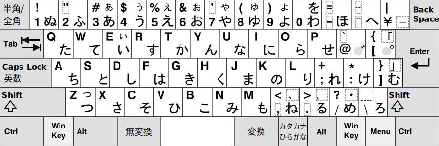

# 単純な換字式暗号

換字式暗号（かえじしきあんごう）とは、文字を置き換えることで作成される暗号です。単純なものであれば、オンライン上のツールを使うことで容易に解読できます。この記事では、厳密な意味での「暗号」に該当しないものでも、謎解きにおいて暗号と同等に扱われるものを取り扱います。

## シーザー暗号 / ROT13

[シーザー暗号](https://ja.wikipedia.org/wiki/%E3%82%B7%E3%83%BC%E3%82%B6%E3%83%BC%E6%9A%97%E5%8F%B7)は最も基本的な換字式暗号の1つです。**平文** （ひらぶん、暗号化される前の文）のアルファベットをずらすことで暗号文を作成します。

ユリウス・カエサル（シーザー）が用いたことからシーザー暗号と称されます。カエサルはアルファベットを3つずらした（シフトした）暗号を運用していたようです。同じ仕組みで13個ずらしたものは **ROT13** と呼ばれます。もちろん、3や13に限定する必要はなく、何文字ずらしてもかまいません。

例えば平文が以下の通りだったとしましょう。
```
PROJECT COLD
```

シフト数3（`A`を3つずらして`D`に、`B`を3つずらして`E`に……）で処理をすると以下のようになります。

```
SURMHFW FROG
```

シフト数5で処理をすると以下のようになります。

```
UWTOJHY HTQI
```

復号手順は非常にシンプルで、ずらされた文字を元に戻すだけです。しかし、実際には「何個ずらした暗号文なのか」が分からないことも多いため、総当たりする必要があるかもしれません。

与えられた文がシーザー暗号/ROT○であることは分かっているが、何文字ずらされているか分からない場合、**[rot13.com](https://rot13.com/)** というサイトに文字を入力し、ROT1、ROT2……とずらしていくことで答えを得られるはずです。

また、大文字・小文字・記号などを含めてシフトする[ROT47](https://dencode.com/ja/cipher/rot47)というものもあります。

基本的には英文に対して適用される暗号ですが、原理上はひらがな・カタカナにも適用できます（参考: [任意ROT N](https://tools.m-bsys.com/original_tools/optional_rotN.php)）。

## みかか

みかかは日本語のWeb上で用いられる暗号の一つです。パソコンの日本語キーボード上にはひらがな入力用の平仮名、そしてローマ字入力用のアルファベットが記載されています。このアルファベットをひらがなで表記するのがみかか暗号です。

2ちゃんねる掲示板で「NTT」を隠語として「みかか」と表記したことが起源だとされています。


*日本語キーボードの画像 [Wikimedia Commons](https://commons.wikimedia.org/wiki/File:KB_Japanese.svg) より*

上記のキーボードの画像を見ると、アルファベット `N` のキーはひらがなで `み`、`T` は `か`であることが分かります。この対応関係を利用した単純な換字式暗号です。

実際に手元にキーボードを用意する必要はなく、**[みかか変換ツール](https://dencode.com/ja/cipher/jis-keyboard)** を使うことで解読できます。

ひらがなを使った暗号文は多いわけではないので、不自然なひらがなの羅列があった場合、真っ先に試してみると良いかもしれません。

なお、日本語以外の言語のキーボードでも、その言語の文字とアルファベットが同時に表記されていることがあるため、変換ツールはありませんが、理論上はほかの言語のキーボードでも「みかか」が成立しうると思います（参考: [Category:各言語のキー配列 - Wikipedia](https://ja.wikipedia.org/wiki/Category:%E5%90%84%E8%A8%80%E8%AA%9E%E3%81%AE%E3%82%AD%E3%83%BC%E9%85%8D%E5%88%97)）。


## Leet

[Leet](https://ja.wikipedia.org/wiki/Leet)（リート）は英語圏のハッカーコミュニティに由来するアルファベットの表記方法です。`l`を `1`、`E` を `3`など、見た目が似ている文字に強引に置き換えるというものです。"leet"自体をleet表記して、`1337`などと表記することもあります。

掲示板などで検索されることを回避するために作られたとされています（日本語で例えば「死」を「ﾀﾋ」と書くような感覚が近いでしょうか）。
実際のleet表記は以下のようになります。
```
hello project cold
↓
h3ll0 pr0j3c7 c0ld
```

注意点として、leet表記する場合は形状が似ている文字であれば何でも構わないため、変換サイト等によっては違った結果になることがあります（特に規格があるわけではありません）。
もし、復元時に不自然な結果になった場合、別のサイトなどを試してみるのもよいでしょう。

- [Universal Leet (L337, L33T, 1337) Converter](https://www.robertecker.com/hp/research/leet-converter.php?lang=en)
- [LEET CONVERTER](https://toolbox.shigurezuki.jp/leet_converter/)
- [1337.me](https://1337.me/)

## 記号や他言語などでの表記

シーザー暗号やみかか暗号は、ある文字を別の文字に変換するものでした。しかし、1対1の対応関係さえあれば、換字式暗号は文字以外で表現することもできます。オンライン謎解きは文字だけでなく、画像や動画で出題されることもあるため、このような形式も想定しておく必要があります。

ここでは、過去に出題された例などを参考に、そのいくつかのパターンを示します。

### 点字・手話

**点字**（Braille）は実用的な記号ですが、ある文字をある記号に置き換えるという意味では、謎解きにおいては換字式暗号の1つだと考えることができます。

また、手話の指文字（ひらがなやアルファベットを1文字ずつ表したもの）も同様の例といえるでしょう。

なお、点字や手話は言語によって変わるため、日本語として読むと意味不明な文字列になってしまった場合、英語のものを試してみるといった工夫も必要です。

参考リンク
- [点字（日本語）](https://ja.wikipedia.org/wiki/%E7%82%B9%E5%AD%97)
- [点字（英語）](https://ja.wikipedia.org/wiki/%E8%8B%B1%E8%AA%9E%E3%81%AE%E7%82%B9%E5%AD%97)
- [手話の指文字（日本語）](https://www.suretalk.mb.softbank.jp/column/contents/000106.php)
- [手話の指文字（日本語、3Dアニメーションによる解説）](https://www.nhk.or.jp/handsign/searchJSL/japanese.html)
- [手話の指文字（アメリカ）](https://en.wikipedia.org/wiki/American_manual_alphabet)

### 有名ではない外国語文字を使った表記

日本ではあまり見かけない外国語の文字や、古代文字などを使った表記もあります。

たとえば、[Ds試験 第6問](https://x.com/daiyonkyokai/status/1865380763094667449)では[オガム文字](https://ja.wikipedia.org/wiki/%E3%82%AA%E3%82%AC%E3%83%A0%E6%96%87%E5%AD%97)が出題されました。このような文字は覚える必要はなく、Google Lensを用いた画像検索などで文字の種類さえ特定できれば、Wikipediaなどに記載されている対応表などを使ってアルファベットに変換（翻字）できます。

また、`Ogham decoder` のように、文字の英語名と "decoder" という単語でGoogle検索すると、文字によっては便利な翻字ツールが見つかるかもしれません。

このような外国語や古代文字の注意点として、必ずしも現代英語のアルファベットや日本語のカタカナと1対1の関係にはならないという点があります。例えば、[ルーン文字](https://ja.wikipedia.org/wiki/%E3%83%AB%E3%83%BC%E3%83%B3%E6%96%87%E5%AD%97)はアルファベットに翻字できますが、文字数が少ないため、英語や日本語で使われる音をすべて表現できるわけではありません。また、1文字がアルファベットの1文字になるとは限らない点にも注意が必要です。これは日本語とローマ字表記を考えれば分かりやすいでしょう。「あ」は「A」1文字で表現できますが、「か」は「KA」と2文字になります。これらの注意点を踏まえ、外国語の文字を使った表記を見たときは、音や文字数については柔軟に考えるとよいかもしれません。

### 腕木通信

**腕木通信**（うでぎつうしん、optical telegraph）は18世紀末からフランスで使用されていた通信方法です。腕木と呼ばれる機械を動かした形で文字を伝達します。

腕木の形とアルファベットの対応関係に決まったものはなく、時代などによって変化したとされています。フランス語版Wikipediaには[架空の対応表](https://commons.wikimedia.org/wiki/File:Chappe.svg)が示されており、腕木がどのような動きをするかの参考にはなるでしょう（また、容易に参照できる根拠として、謎解きでもこの表が使われる可能性はありそうです）。

情報セキュリティの大会「SECCON」では、[50分に及ぶ腕木通信の動画を解読することでQRコードが得られる問題](https://www.youtube.com/watch?v=Y6voaURtKlM)が出題されたこともあります。この動画では、腕木とアルファベットの対応関係を明確にするために、冒頭に文字を書き起こすシーンが含まれています。

### 手旗信号

**手旗信号**（てばたしんごう、flag semaphore） は、船舶の上で人が旗を振って文字を伝える手法です。腕木通信をもとに、人間が行えるように工夫されたものです。こちらは腕木通信と異なり、文字と旗の対応関係が規格として決まっており、復号が可能です。

英語の手旗信号は1文字あたり1つの動き（形）になっています（[動画](https://www.youtube.com/watch?v=LFWQ6usrSCM)）。しかし、[日本語の手旗信号](https://web.archive.org/web/20010205071800/https://www.jsf.fukuoka-city.com/jsffm21.html)は複数の動きを組み合わせて1文字を表現します（[動画](https://www.youtube.com/watch?v=TqdOgEgFGmM)）。

英語版に関しては **[dCodeのSemaphore Decoder](https://www.dcode.fr/semaphore-flag)** のような解読ツールも存在します。

### 国際信号旗

**国際信号旗**（旗りゅう信号、international maritime signal flags）も、船舶の通信に用いられる旗です。旗の1枚1枚に「援助を求む」「本船を避けよ」のような意味があるだけでなく、連続して掲揚することにより、アルファベットや数字の伝達が可能です。日本語（かな）はありません。

**[dCodeのNavy Signal Flags Decoder](https://www.dcode.fr/maritime-signals-code)** のような解読ツールが存在します。

- 参考記事: [国際信号旗｜お役立ちマリン情報](https://wam.sub.jp/home/contents/info/flag.html)

### 踊る人形

**[踊る人形](https://ja.wikipedia.org/wiki/%E8%B8%8A%E3%82%8B%E4%BA%BA%E5%BD%A2)**（The Dancing Men） はアーサー・コナン・ドイルによる小説です。その中で用いられた換字式暗号も「踊る人形」と称されます。アルファベットと人の動きが1対1に対応している、シンプルなものです。

小説に登場しなかった8文字（F, J, K, Q, U, W, X, Z）は定義されていませんが、非公式に補われたものが暗号として用いられる事が多いようです。**[dCodeのDancing Men Decoder](https://www.dcode.fr/dancing-men-cipher)** のような解読ツールが存在します。

- 参考記事: [Dancing Men Alphabet - The Arthur Conan Doyle Encyclopedia](https://www.arthur-conan-doyle.com/index.php/Dancing_Men_Alphabet)

### 楽譜・音符

音階はド、レ、ミ……やC, D, E...のように文字で表現できるため、楽譜の表記で文字を表現する謎もあります。また、[音階にアルファベットを割り当てた暗号](https://ericsams.org/index.php/on-cryptography/333-musical-cryptography)も考案されています。

- 参考記事
  - [音名と階名 - Wikipedia](https://ja.wikipedia.org/wiki/%E9%9F%B3%E5%90%8D%E3%81%A8%E9%9A%8E%E5%90%8D)（[英語版](https://en.wikipedia.org/wiki/Key_signature_names_and_translations)）
  - [メッセージを暗号化して「音」の一つ一つに置き換える遊びが大作曲家たちによって行われていた - GIGAZINE](https://gigazine.net/news/20180330-musical-cryptography/)