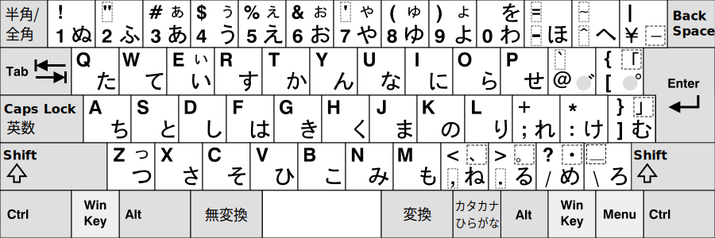

# 単純な換字式暗号

換字式暗号（かえじしきあんごう）とは、文字を置き換えることで作成される暗号です。単純なものであれば、オンライン上のツールを使うことで容易に解読できます。

## シーザー暗号 / ROT13

[シーザー暗号](https://ja.wikipedia.org/wiki/%E3%82%B7%E3%83%BC%E3%82%B6%E3%83%BC%E6%9A%97%E5%8F%B7)は最も基本的な換字式暗号の1つです。平文（ひらぶん、暗号化される前の文）のアルファベットをずらすことで暗号文を作成します。

ユリウス・カエサル（シーザー）が用いたことからシーザー暗号と称されます。カエサルはアルファベットを3つずらした（シフトした）暗号を運用していたようです。同じ仕組みで13個ずらしたものは **ROT13** と呼ばれます。もちろん、3や13に限定する必要はなく、何文字ずらしてもかまいません。

例えば平文が以下の通りだったとしましょう。
```
PROJECT COLD
```

シフト数3（`A`を3つずらして`D`に、`B`を3つずらして`E`に……）で処理をすると以下のようになります。

```
SURMHFW FROG
```

シフト数5で処理をすると以下のようになります。

```
UWTOJHY HTQI
```

復号手順は非常にシンプルで、ずらされた文字を元に戻すだけです。しかし、実際には「何個ずらした暗号文なのか」が分からないことも多いため、総当たりする必要があるかもしれません。

与えられた文がシーザー暗号/ROT○であることは分かっているが、何文字ずらされているか分からない場合、**[rot13.com](https://rot13.com/)** というサイトに文字を入力し、ROT1、ROT2……とずらしていくことで答えを得られるはずです。

また、大文字・小文字・記号などを含めてシフトする[ROT47](https://dencode.com/ja/cipher/rot47)というものもあります。

基本的には英文に対して適用される暗号ですが、原理上はひらがな・カタカナにも適用できます（参考: [任意ROT N](https://tools.m-bsys.com/original_tools/optional_rotN.php)）。

## みかか

みかかは日本語のWeb上で用いられる暗号の一つです。パソコンの日本語キーボード上にはひらがな入力用の平仮名、そしてローマ字入力用のアルファベットが記載されています。このアルファベットをひらがなで表記するのがみかか暗号です。

2ちゃんねる掲示板で「NTT」を隠語として「みかか」と表記したことが起源だとされています。


*日本語キーボードの画像 [Wikimedia Commons](https://commons.wikimedia.org/wiki/File:KB_Japanese.svg) より*

上記のキーボードの画像を見ると、アルファベット `N` のキーはひらがなで `み`、`T` は `か`であることが分かります。この対応関係を利用した単純な換字式暗号です。

実際に手元にキーボードを用意する必要はなく、**[みかか変換ツール](https://dencode.com/ja/cipher/jis-keyboard)** を使うことで解読できます。

ひらがなを使った暗号文は多いわけではないので、不自然なひらがなの羅列があった場合、真っ先に試してみると良いかもしれません。

なお、日本語以外の言語のキーボードでも、その言語の文字とアルファベットが同時に表記されていることがあるため、変換ツールはありませんが、理論上はほかの言語のキーボードでも「みかか」が成立しうると思います（参考: [Category:各言語のキー配列 - Wikipedia](https://ja.wikipedia.org/wiki/Category:%E5%90%84%E8%A8%80%E8%AA%9E%E3%81%AE%E3%82%AD%E3%83%BC%E9%85%8D%E5%88%97)）。


## Leet

Leet（リート）は


## 記号や他言語などでの表記

シーザー暗号やみかか暗号は、ある文字を別の文字に変換するものでした。しかし、1対1の対応関係さえあれば、換字式暗号は文字以外で表現することもできるはずです。オンライン謎解きは文字だけでなく、画像や動画で出題されることもあるため、このような形式も想定しておく必要があります。

ここでは、過去に出題された例などを参考に、そのいくつかのパターンを示します。

### 点字・手話

点字は実用的な記号ですが、ある文字をある記号に置き換えるという意味では、謎解きにおいては換字式暗号の1つだと考えることができます。

また、手話の指文字（ひらがなやアルファベットを1文字ずつ表したもの）も同様の例といえるでしょう。

なお、点字や手話は言語によって変わるため、日本語として読むと意味不明な文字列になってしまった場合、英語のものを試してみるといった工夫も必要です。

参考リンク
- [点字（日本語）](https://ja.wikipedia.org/wiki/%E7%82%B9%E5%AD%97)
- [点字（英語）](https://ja.wikipedia.org/wiki/%E8%8B%B1%E8%AA%9E%E3%81%AE%E7%82%B9%E5%AD%97)
- [手話の指文字（日本語）](https://www.suretalk.mb.softbank.jp/column/contents/000106.php)
- [手話の指文字（日本語、3Dアニメーションによる解説）](https://www.nhk.or.jp/handsign/searchJSL/japanese.html)
- [手話の指文字（アメリカ）](https://en.wikipedia.org/wiki/American_manual_alphabet)

### 楽譜・音符


### 有名ではない外国語文字を使った表記

日本ではあまり見かけない外国語の文字や、古代文字などを使った表記もあります。

たとえば

