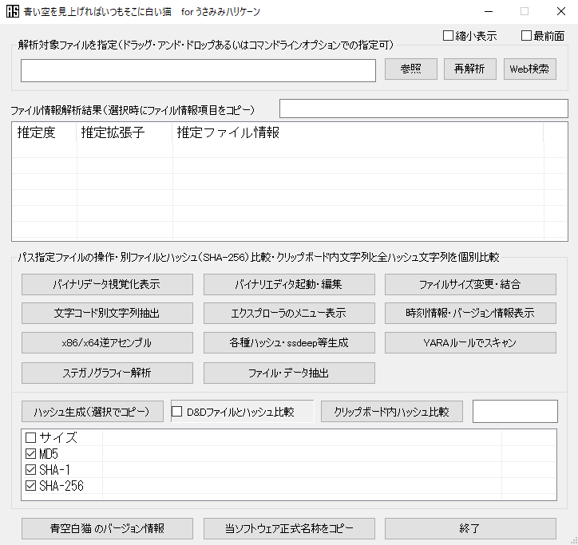
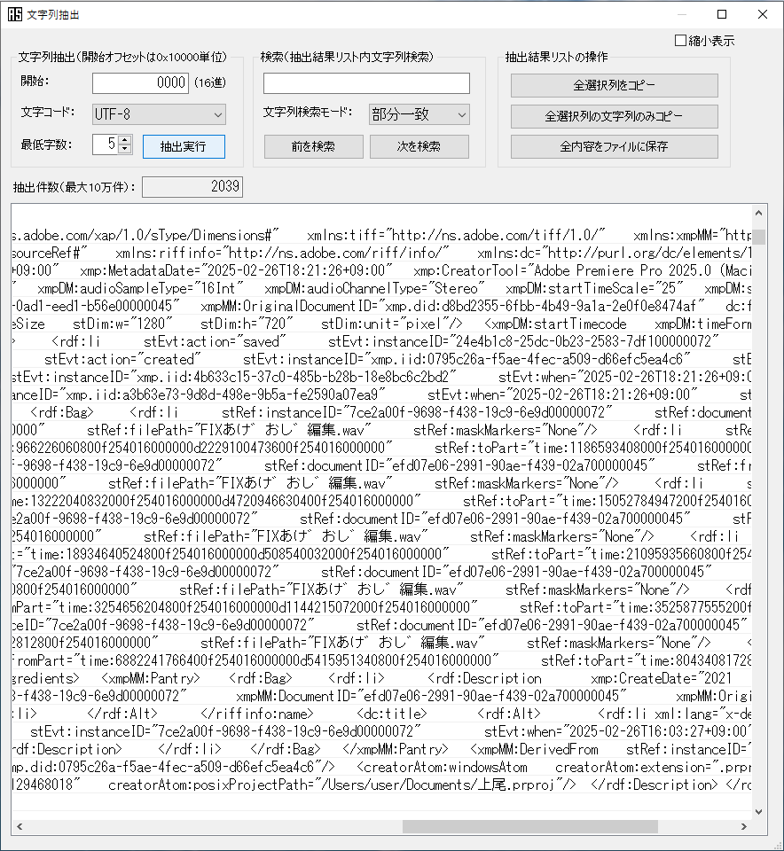
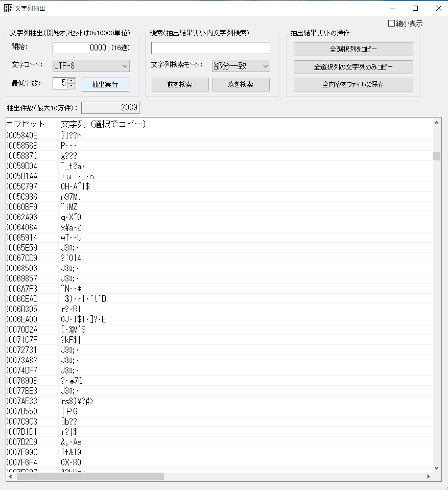
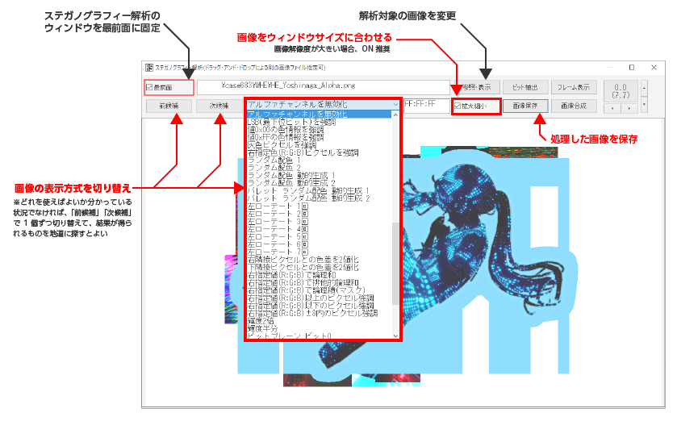
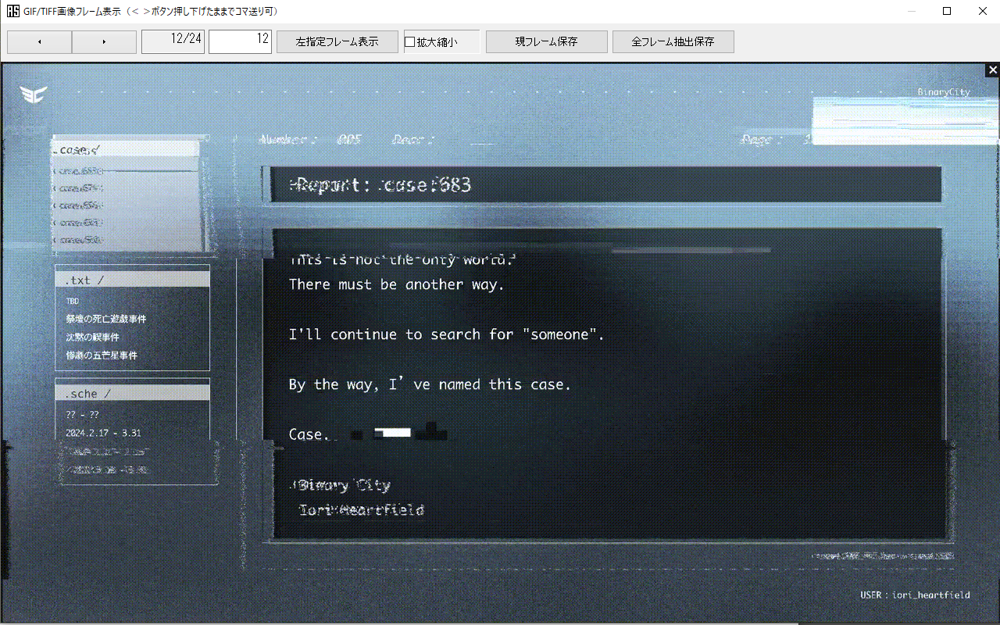
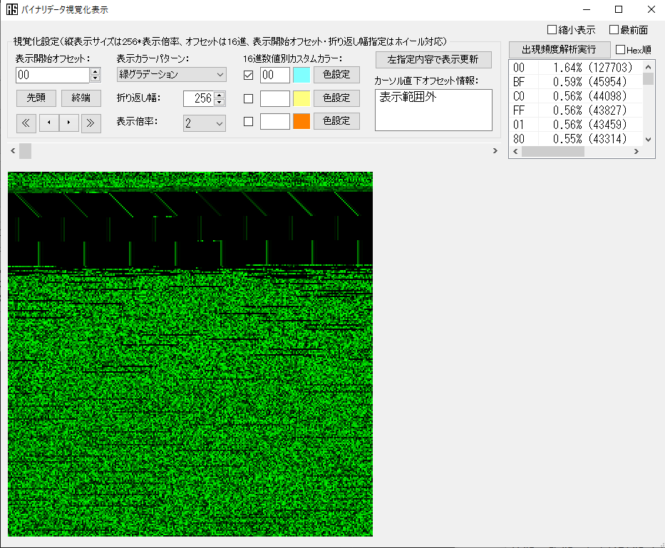

# 「青空白猫」を利用したファイルの分析

「青い空を見上げればいつもそこに白い猫」という分析ツールがあります。正式名称が長いので、通称「 **青空白猫** （あおぞらしろねこ） 」と呼ばれます。
本来は情報セキュリティ分野で使用されるツールですが、ARG・謎解きに登場するファイルの解析にも活用できると思われます。

このページでは、ファイル分析の初心者向けに青空白猫の使い方を解説します。（Windows環境のみサポートされています。）

## うさみみハリケーンの導入

「青空白猫」は「うさみみハリケーン」というツールに同梱されています。まず、以下のページから「うさみみハリケーン」をダウンロードし、任意のフォルダに展開しましょう。

https://www.vector.co.jp/soft/win95/prog/se375830.html

**AoZoraSiroNeko.exe** という実行ファイルがあると思います。これが青空白猫です。

## 青空白猫の起動と基本的な使い方

青空白猫を起動すると以下のような画面が表示されます。基本的には「 **参照** 」をクリックしてファイルを読み込み、その内容を様々なメニューから解析するというものです。

難しそうに見えるかもしれませんが、すべての機能を使用するわけではないのでご安心ください。ARGで与えられた画像や文書の解析を行う場合は「文字コード別文字列抽出」と「ステガノグラフィー解析」だけでも十分でしょう。

### 文字コード別文字列抽出

ファイル内に含まれている文字列を抽出するものです。例えばメタデータ内に何らかの情報が含まれている場合、この機能で抽出できることもあります。
文字コードを色々変更してみて試すとよいでしょう。

ただし、この機能で得られるのは、ファイル内に含まれているデータのうち、文字列として解釈できるものを機械的にすべて抽出したものにすぎません。  
例えば、以下の文字列はメタデータ部分の抽出に成功したものだといえます。

しかし、以下のような文字列は特に意味があるものではない（文字列としてファイルに仕込まれたものではない）といえます。

### ステガノグラフィー解析

もし、画像内に文字列や情報などが隠されている場合、このツールで読み解ける場合があります。  
画像の表示方法を1個ずつ切り替えていき、何か有用な情報が得られないか探るとよいでしょう（大抵の画像には何もありませんが、画像が疑わしいと思ったら根気よく見ていきましょう）。

### アニメーションGIFのフレーム表示（コマ送り）

アニメーションGIFが与えられた場合、「ステガノグラフィー解析」ツールにある「フレーム解析」ボタンをクリックすると、画像のコマ送りが可能になります。  
また、フレーム（コマ）を切り出して保存することも可能です。

### バイナリデータ視覚化表示

バイナリデータの数値を一定の条件で着色して可視化するツールです。ARG・謎解きにおいてここに何かが含まれている可能性は低いのですが、原理上はモールス信号を仕込むことなどが可能（例：[picoCTF 2022](https://digitaltravesia.jp/CTF/picoCTF2022/picoCTF_2022_Writeup.html)）なので、見ておいて損はないかもしれません。

## そのほかのメニューについて

これ以外のメニューやツールについては、各種ドキュメントを参照するとよいでしょう。CTF関連のドキュメントなどが有用です。

- [汎用ファイルアナライザ「青い空を見上げればいつもそこに白い猫」（略称：青空白猫）](https://digitaltravesia.jp/usamimihurricane/webhelp/_RESOURCE/MenuItem/another/anotherAoZoraSiroNeko.html) - 公式サイト。「PicoCTF」のWriteupのリンクでは実際にCTFの問題でどのように活用するかが示されている。
- [「青い空を見上げればいつもそこに白い猫」のススメ](https://speakerdeck.com/am7cinnamon/qing-ikong-wojian-shang-gerebaitumosokonibai-imao-falsesusume) - 