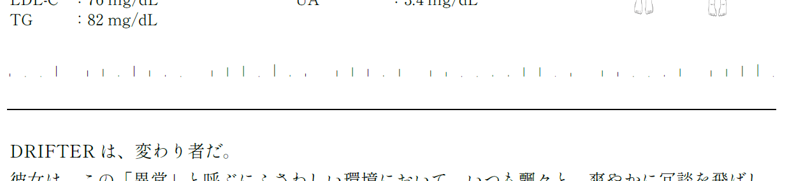
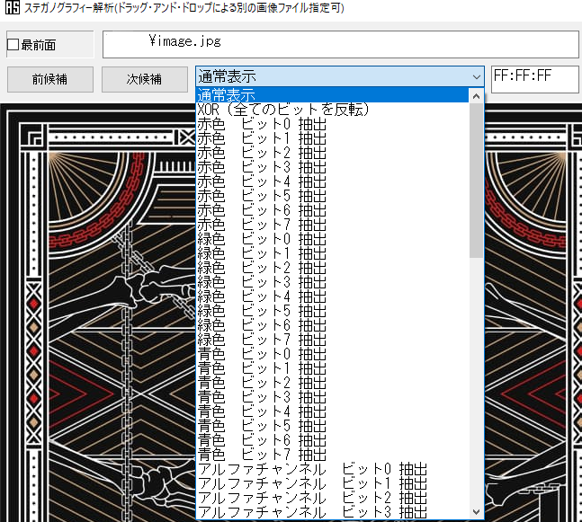

# 隠されたテキスト

いろいろな手段を使うことによって、ファイルに文字を隠匿することができます。

## PDFファイルへの文字列の隠匿

謎解きにおいて、PDFファイルに文字列を隠すにはいくつかの手法があります。

- 文字列を背景色（白）と同じにする
- 文字列の上に四角形などを置いて隠す
- 文字に特殊なフォントを適用し、文字として見えないようにする

これらは通常通り表示しただけでは気付けないのですが、文字としてはファイル内に存在しているため、文字列をドラッグして選択するとコピーアンドペーストできるようになっています。

なお、筆者が作成したツール「[PDF Footprint finder](https://pdf-footprint.vercel.app/)」では、ブラウザ上からPDF内の文字列をすべて抽出できるようになっているので、活用できると思います。

### 実例: Project:;COLD case.674での実例

Project:;COLD case.674 では、PDFファイルに特殊なフォントを適用した問題が存在しました。

ファイル中央部分に薄い縦線が羅列された部分があるのですが、これは特殊なフォントが割り当てられたもので、編集ソフトで選択すると[Unicodeエスケープシーケンス](https://dencode.com/ja/string/unicode-escape)で表現された文字列が得られるようになっていました。

## 画像のステガノグラフィ

画像内にさまざまな手段で文字列を隠す手法があります。目視できないような薄い色で文字を書き込む単純なものから、ファイル自体に技術的な細工をするものまで様々なものがあります。

Web上から利用できるツールで有名なものは **[Aperi'Solve](https://www.aperisolve.com/)** で、ファイルをアップロードすると様々な解析を一気に試してくれます。

また、Windows環境であれば「[うさみみハリケーン](https://digitaltravesia.jp/usamimihurricane/HowToUseUsaMimi.html)」に含まれている「**[青い空を見上げればいつもそこに白い猫](https://digitaltravesia.jp/usamimihurricane/webhelp/_RESOURCE/MenuItem/another/anotherAoZoraSiroNeko.html)**（青空白猫）」というツールも便利です。こちらで画像ファイルを読み込み、「ステガノグラフィー解析」を行い、表示内容を切り替えていくと、何か隠された文字や図形などを見つけることができるかもしれません。

## より高度なステガノグラフィ

CTF（情報セキュリティの大会）ではsteghideやstegseekが使用されることがあります。

- 参考記事: [SteghideとStegseekを使ってみる](https://iomat.hatenablog.com/entry/2022/06/27/182746)