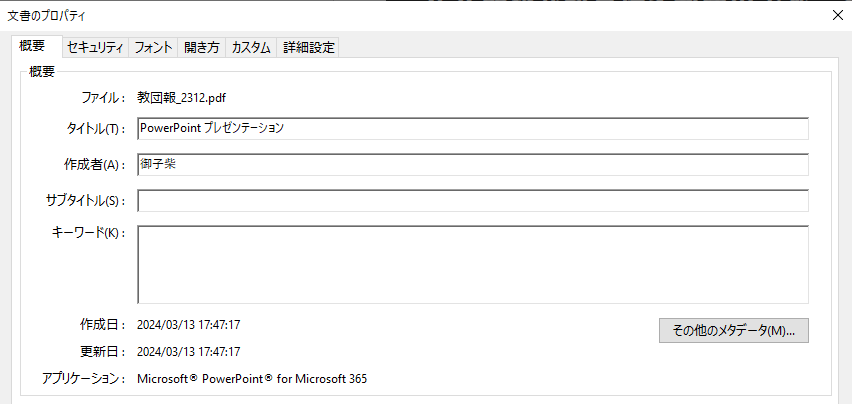

# メタデータ

メタデータとは、ファイルの内容を説明するためのデータです。例えば音楽ファイルであればアーティストの情報、文書であれば作成者の情報といったことが記録されています。

## 画像データ

スマホやデジカメで撮影された写真には、Exif（イグジフ）と呼ばれる画像データが含まれています。
撮影時のカメラの設定などが記録されていますが、ものによっては撮影地点のGPSデータが記録されていることもあります。

[METADAT2GO](https://www.metadata2go.com/)や[Online Exif Viewer](https://onlineexifviewer.com/)のような、Webサイトを使って確認すると手軽でしょう（スマホからでも確認できます）。注意点として、このようなWebサービスはアップロードされた写真をどのように使用するか保証されていない点があります。あなたのプライベートな写真などで試すことは避けましょう。

ファイルを他者に送信せずにチェックするには、自分のPCやスマホ上でチェックすると良いでしょう。Windowsの場合、画像データを右クリックして「プロパティ」を表示すると簡易的にチェックできます。

応用的ではありますが、コマンドラインツールを使える人は[ExifTool](https://exiftool.org/)を使うとローカルで各種メタデータを閲覧できて便利です。

## 文書データ

PDFやWord、Excel、PowerPointなどの文書ファイルにもメタデータは存在しています。

### PDF

パソコンから[Adobe Reader](https://get.adobe.com/jp/reader/)を使ってPDFファイルを開き、メニューから「文書のプロパティ」をクリックすると、その文書のメタデータが閲覧できます。

また、筆者が[PDF Footprint Finder](https://pdf-footprint.vercel.app/)というWebサイトを開発したので、スマホからはここを使うとよいでしょう（データはアップロードされません）。もちろんPCからもブラウザで利用できます。

### Office (Word, Excel, PowerPoint)

ドキュメントの作成者などを「ファイル」タブの「情報」から閲覧できます。

- 参考記事: [他人のWord文書を転用した証拠が丸見え、あの「設定値」に要注意](https://xtech.nikkei.com/atcl/nxt/column/18/01036/102400001/)

## 音楽データ

MP3のような音楽ファイルにもメタデータは存在しています。「プロパティ」から確認してもよいのですが、専用のツールも存在します。

- 参考記事: [高機能かつ使いやすい タグエディタ！「Mp3tag」](https://www.gigafree.net/media/mu/mp3tag.html)。