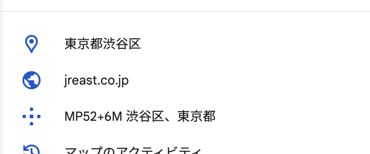
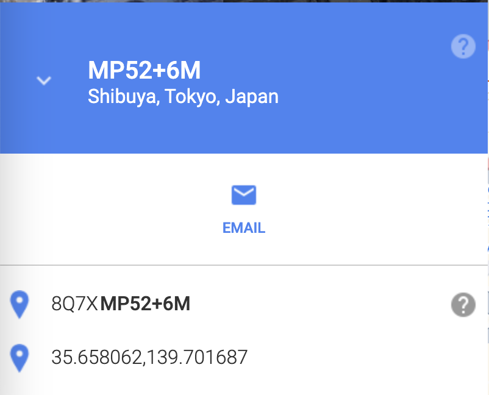

# 地点を示す手段

地図上の地点を示すには、様々な手段が存在しています。このページでは、謎解きで実際に使われたことがあるものや、今後使われるかもしれない手法をご紹介します。

## 座標（緯度・経度）

緯度（latitude）、経度（longitude）は地球上の座標を示す基本的な手段です。ただし、表現方法には様々なバリエーションがあります。最もわかりやすい例が **10進表記** と **60進表記** でしょう。

- 10進表記: `35.627848, 139.771857` のような表現です。Google Mapsなどで利用されます。特記がない限りこの表記だと思ってよいでしょう。
- 60進表記: `北緯:35度37分40秒252, 東経139度46分18秒685`のような表現です。
  - 1度は角度でおなじみの表現で、円の$\frac{1}{360}$を意味します。1分は$\frac{1}{60}$度、1秒は$\frac{1}{60}$分を意味します。

10進・60進は[オンライン上のツール](https://www.motohasi.net/GPS/PosConv.php)で相互に変換できます。

- 参考ページ: [経緯度データを扱う全ての方に知っておいていただきたいこと](https://info.qchizu.xyz/2024/06/09/latlng/)

また、主に10進表記では「北緯」「東経」などが省かれて表現される場合も多々あります。その場合、**正の値** は北緯・東経を示し、**負の値** は南緯・西経を示します。以下にその例を示します。

- `35.627848, 139.771857` → `北緯:35.627848, 東経:139.771857`（東京・お台場）
- `-33.857054, 151.215091`→ `南緯:-33.857054, 東経:151.215091`（オーストラリア・シドニー）
- `47.449073, -122.307949`→ `北緯:47.449073, 西経:-122.307949`（アメリカ合衆国・シアトル）

また、「緯度・経度」の順番で表記されることが多いのですが、地図サービスなどによっては「経度・緯度」と逆に表記されることもあります。マップサービスに入力して、変な結果が出た場合は逆にしてみると良いかもしれません。

## what3words

**[what3words](https://what3words.com/ja/about)（ワットスリーワーズ、w3w）** は、イギリスのwhat3words社が開発した位置情報表示システムです。同社による独自の計算で、地球上のあらゆる場所を「3つの単語」で表現できるというものです。住所システムが整備されていない発展途上国や、砂漠や山林のような住所がないような場所であっても、緯度経度を用いるより容易に示せるというのが同社によるセールスポイントです。

例えば、渋谷のハチ公像がある場所は `///いちば。こうてい。おいて` 、大阪の太陽の塔の中心部は `///みぶり。はりえ。ずひょう` です。

「地図上の場所を3単語で表現できる」という特徴から、謎解きイベントやCTFなどでも出題されることが多々あります。

### w3wの特徴・仕様

w3wの仕様を知っておくことで、出題されたときに対応しやすくなるかもしれません。

- what3wordsと対応する場所は[公式サイト](https://what3words.com/)から検索できる。スマホアプリもある。
- what3wordsで表現されるコードを示す場合、3つの単語の先頭に `///` （スラッシュ3つ）を付ける。
- 同じ単語の組み合わせでも、順番が変われば指す場所も変わる。
  - 例えば、`///いちば。こうてい。おいて` と `///こうてい。いちば。おいて` は全く別の場所。
- 使用される単語は数万語ある。
    - そのため、「残り1単語」を総当たりするのは困難。
- 緯度経度と単語を相互に変換するアルゴリズムは非公開なので、必ずwhat3words社のサイトやアプリを使う必要がある。
    - 当然ながら、謎解き運営者が「この地点にこの単語を設定する」といったことはできない。w3wが定めたものを使うしかない。
- 近接する場所に似たような単語が出現することはない。
    - 口頭で伝えたときなど、紛らわしい場所に案内されるのを防ぐための仕組み。
- 多言語対応しており、言語によって仕様が異なる。
  - Webサイトから、他言語での表示に切り替えが可能。また、Webサイトでの検索時はどの言語でのコードを入力してもOK。
  - 日本語の場合、単語の区切りには `。`（句点）を使う。英語など他の言語では`.`（ピリオド）を使う。
  - 同じ場所を示す3wordsでも、言語によって全く意味が異なる単語が使われる。以下はいずれもハチ公を示す場所。
    - 日本語: `///いちば。こうてい。おいて`
    - 英語: `///crowned.javelin.salad`（王位についた、槍、サラダ）
    - 中国語（簡体字）: `///如实.隔日.照料`（ありのままに、1日おきに、世話をする）

## plus codes

**plus codes（プラスコード）** はGoogleが開発した、地点を表現するためのコードです。アルゴリズムは公開されています。

plus codesでは `JQHC+4Q` のようにアルファベットと数字、そしてプラス記号を使って地点を表現します。この値は[plus codesのサイト](https://plus.codes/)で得ることができるほか、Google Mapsにも表示されています。

ただし、注意点がいくつかあります。Google Mapsでは `MP52+6M` といった7桁の数字が表示されていますが、実は**これだけでは場所を一意に示すことができません**。

`MP52+6M`という7桁のコードは「 **ショートコード** 」と呼ばれる、都市内での場所を示すコードです。たとえば「東京周辺でのMP52+6M」は渋谷駅を示すのですが、「札幌周辺でのMP52+6M」は苫小牧市沼ノ端を、「大阪周辺でのMP52+6M」は奈良県生駒市小平尾町の地点を示します。また、スマホアプリで検索すると、最寄りの地域を示します。そのため、plus codesを入力してもよく分からない場所が表示されたときは、都市に関する情報が欠落している可能性があります。

もし、plus codesを使って全世界で一意に場所を示したい場合、plus codesのサイトを使って、ショートではない長いコードを取得する必要があります。
以下のリンクは渋谷駅のコードを取得したもので、`8Q7XMP52+6M` という表記になることがわかります。

https://plus.codes/8Q7XMP52+6M

また、plus codesが表現しているのは、正確には地点（ピンポイント）ではなくグリッド（枠）です。このグリッドはplus codesが長くなると狭く範囲を、短くなると広い範囲を示します。そのため `8Q7XMP52+6M` と検索するより、`8Q7XMP52+`と検索したほうが広いエリアを示すことになります。

## Geohash

Geohash（ジオハッシュ）は、座標を短い文字列で表現する手法です。w3wやplus codesとの違いは、人間による口頭の伝達ではなく、データベース処理などコンピュータ上で取り扱うことにに向いているという点です。アルゴリズムは公開されているため、公式サイト以外にも複数のサイトで変換が可能です。

`xn77h26q` のような形で、アルファベットと数字で表現されます。

- http://geohash.org/ : 公式サイトです。少し古いので扱いづらいかも。
- https://geohashsite.app/ : 使い方が少し特殊かもしれません。検索ボックスに `緯度 経度 桁数`の形でスペース区切りで値を入力し、Enterを押すと変換されます。また、マップをクリックするとピンが表示され、その地点の緯度経度が検索ボックスに入力されます。

geohashも地点をグリッドで表現するもので、文字数が多くなればなるほど狭いグリッドを表現します。例えば、`xp05kpg` という7文字のgeohashが示すグリッドは、 `xp05`という4文字のgeohashが示すより広いグリッドの中に含まれています。

## マップコード

**マップコード**は、日本のデンソー社が開発した、地点を数字のみで表現するコードです。カーナビで使用されているほか、ネット上からは「マピオン」のような地図サイトで検索・変換できます。基本的には日本のみカバーされています。

`169 404*06` のような形で、アスタリスク(*)を含んでいるのが特徴です。

使い方についてはマピオンの公式ヘルプをご覧ください。    
https://help.mapion.co.jp/search/mapcode.html

## MGRS（UTMグリッド）

**[MGRS（Military Grid Reference System）](https://en.wikipedia.org/wiki/Military_Grid_Reference_System)** は、NATOおよびその同盟国などが地球上の場所を示すために使うグリッドシステムです。名前の通り、軍事作戦のために作られたものです。日本の国土地理院は **UTMグリッド** と呼んでいます。

`54SUE90403444` のような、数字とアルファベットを両方含んだ形式です。

他のグリッドシステムと同様、短いコードよりも長いコードのほうが細かいエリアを示しています。たとえば、`54SUE90403444` というグリッドは `54SUE` という大きなグリッドの中に含まれています。

- 参考記事: [完全理解！MGRS (Military Grid Reference System)](https://www.wingfield.gr.jp/archives/6833)

大きな特徴はそのサイズです。他のグリッドシステムは地球を緯度経度に基づいて分割しているため、赤道と北極・南極でサイズが変わってしまいます。しかし、MGRS正確な軍事作戦を遂行するため、どこのグリッドもすべて同一のサイズになるという特徴があります。しかし、その代わりにグリッドが重なってしまう（同じ地点が複数のグリッドに含まれてしまう）という特徴も持っています。つまり、1箇所の座標を表現するにしても、複数のグリッドの候補があるということです。

以下のようなサービスで変換できます。  
http://www.legallandconverter.com/p50.html

また、日本国内に関しては国土地理院の地理院地図でもUTMグリッドを表示できます。  
https://maps.gsi.go.jp/help/pdf/grid.pdf