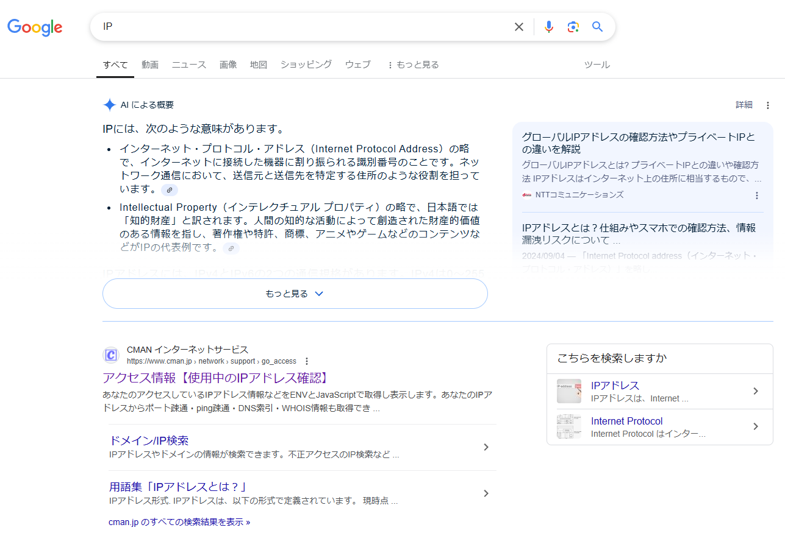

# Google検索コマンド

Google検索には、誰もが無意識に使っているものから、なかなか使わない高度なものまで、様々なコマンドが存在します。
これらを使いこなすことで、検索謎で必要な情報を素早く得ることができるようになります。

## 基本コマンド

### AND検索

複数の単語を並べて検索するもので、これは無意識に使っている人も多いでしょう。

`方言　沖縄　辞書`　のように、複数の単語をスペースで区切って検索することにより、すべての単語を含む検索結果のみを表示することができるようになります。

ただし、最近のGoogle検索は純粋なAND検索を実行している訳ではないようで、列挙した単語が全部含まれていないものも検索結果に表示するようです。

### NOT検索

たとえば「IP」という略語について調べたいとき、普通に `IP` と検索すると「IPアドレス」に関する情報がたくさんヒットします。
このとき、IPアドレスに関する情報を検索対象から外したいときは `IP -アドレス` のように、除外したい単語の前に半角ハイフンを入れましょう。

*`IP`で検索した結果*

*`IP -アドレス` で検索した結果*

### 完全一致検索
Googleは検索時に気を利かせて、表記揺れなども併せて検索してくれるのですが、時にはこれが邪魔になってしまいます。
そこで、キーワードを **ダブルクォーテーション** （`"`）で囲むことで、完全一致したワードや文を検索することができます。

例えば `現実と仮想の間` とGoogle検索しても、第四境界関連のコンテンツはヒットしないのですが、`"現実と仮想の間"`と検索することで第四境界の公式サイトがヒットします（2024年12月時点のWebサイト）。特にこういった文のような表現で効果を発揮しやすいです。

また、完全一致検索は `"現実と仮想の間" 第四境界 -メタバース` のように、他の検索コマンドと組み合わせることもできます。

### 期間指定
検索ワードに `before:2023-01-15` や `after:2024-12-02` と付け加えることで、期間指定が可能になります。

## 応用的なコマンド

様々な検索コマンドを駆使して、様々な情報を引き出すことは Google Dorks（グーグル・ドーク）やDorking（ドーキング）と呼ばれます。ただし、DorksはGoogleによる正式名称ではありません。

以下にGoogle Dorksでも用いられる、応用的なコマンドの例を示します。

|コマンド|説明|例|
|:---|:---|:---|
|`site:`|特定のWebサイト内を検索する|`風張 site:altarcarnival.com`|
|`filetype:`|特定のファイル形式に絞り込んで検索する|`"papiermembrane" filetype:pdf`|
|`intitle:`|ページタイトルに含まれる文字を検索|`intitle:職員 site:altarcarnival.com`|
|`inurl:`|URLに含まれる文字列を検索|`inurl:inui site:altarcarnival.com`|
|`link:`|URLへのリンクを含むページを検索|`link:www.daiyonkyokai.net`|
|`related:`|URLに関連するサイトを検索|`related:www.daiyonkyokai.net`|
|`*`|ワイルドカード|`site:*.example.com`|
