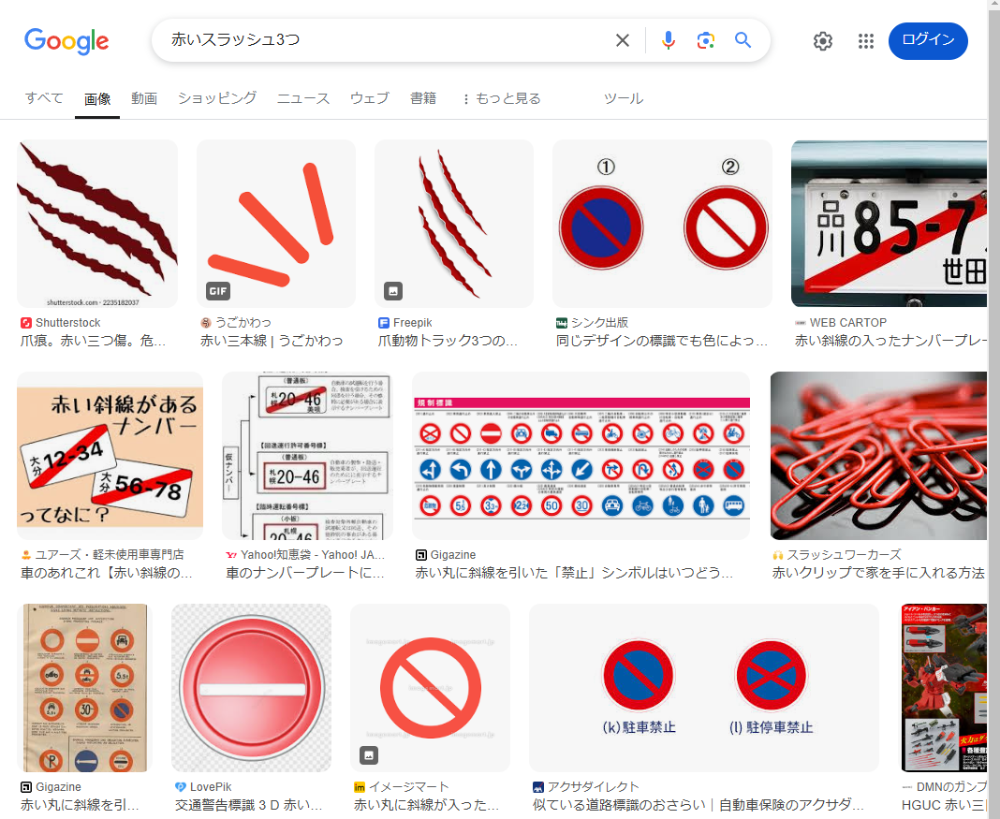
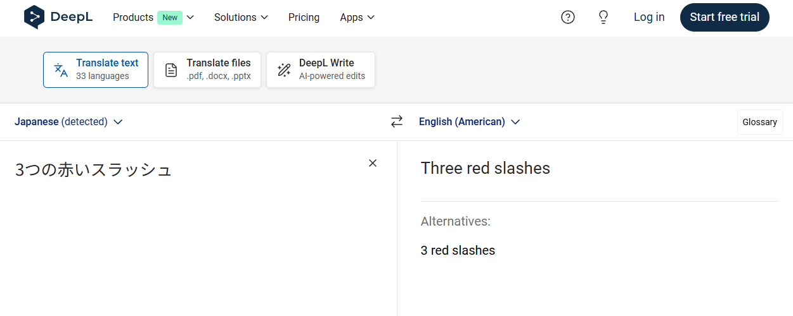
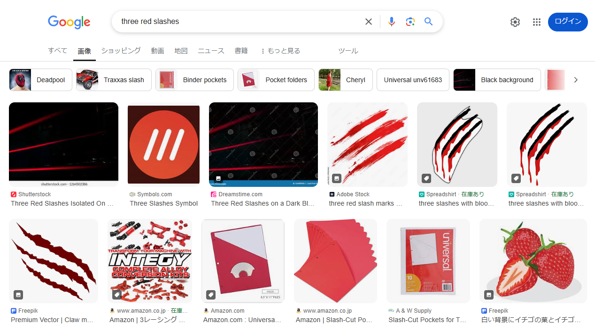
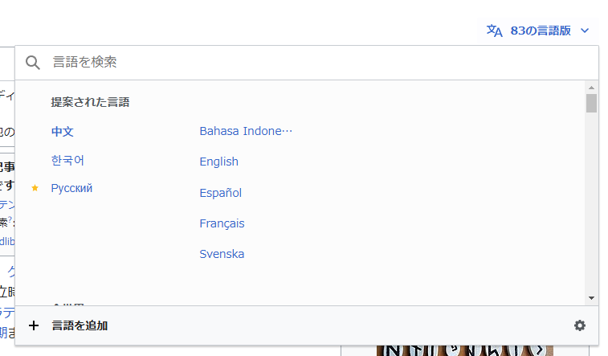
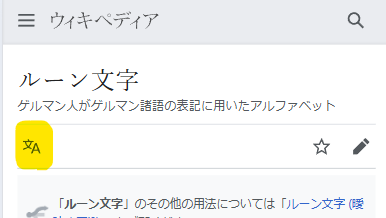

# 多言語情報の検索

検索謎においては、日本語以外を使うとスムーズに結果が得られるケースもあります。
外国語が苦手であっても、翻訳ツールを使えば大丈夫です。

## ブラウザの翻訳機能の活用

Google Chromeなどのブラウザでは、外国語のページを自動翻訳することが可能です。非常に便利なので試してみてください。

操作方法はお使いのブラウザによって違いますが、PC・スマホともに主要なブラウザ（Chrome、Safari、Edge）は翻訳に対応しています。

## 検索ワードを翻訳する

当然ながら、日本語で検索すると日本語で書かれたページばかりがヒットします。英語話者の方が圧倒的に多いことを考えると、英語で検索するだけで得られる情報の数は格段に増えます。また、特定の国や文化に関する情報であれば、その国の言語で調べる方が得られる情報が多いというケースもあるでしょう。

もちろん、外国語を身につけるべきだという話ではないので、Google翻訳やDeepL翻訳を使ってかまいません。

### 事例:Ds試験 第2問・第5問

[Ds試験 第2問](https://x.com/daiyonkyokai/status/1849043483283325319)では、問題文中に登場した赤いスラッシュ3つが「what3words」を意味していると認識する必要があります。もちろんwhat3wordsのことを知っていれば解ける問題ではあるのですが、知らない場合はこれを検索する必要があります。

Ds試験開催時に日本語で「赤いスラッシュ3つ」などと画像検索しても、特に有益な情報は得られませんでした。

そこで、DeepLでこれを翻訳すると、`Three red slashes` という英語表記を手に入れることができます。

英語表記で画像検索すると、画像検索2番目にスラッシュ3つのアイコンがヒットし、リンク先からwhat3wordsについて知ることができます。

また、[Ds試験第5問のヒント](https://x.com/daiyonkyokai/status/1862874269220573216)では、「踊る男」と「暗号」に"the dancing man" "code"と英語表記が書かれていました。`踊る男 暗号` と日本語で検索すると暗号についての解説が出るだけなのですが、`the dancing man code` と英語で検索すると、[解読のためのツール](https://www.dcode.fr/dancing-men-cipher)がヒットします。このヒントの出し方を踏まえると、多言語を使った検索を作問側が想定しているように思われるため、今後の問題でもこの検索手法が有効になる可能性は高いといえるでしょう。

## 他言語版のWikipedia

調べ物をしていると、Wikipediaに行き着くことも多いでしょう。Wikipediaは世界各国の言語で書かれており、言語によって書かれている内容や分量が異なることがよくあります。日本語版を見てもあまり情報が得られなかった場合、言語を切り替えてみるというのも一つの手です。

パソコンからであれば、ページ右上の「○つの言語版」というリンクをクリックすると、他言語版の一覧が表示されます。

スマホからであれば、「文A」というアイコンをタップすると、他言語版の一覧が表示されます。

もちろん、他言語ページを自力で読むのは大変だと思うので、自動翻訳機能を活用しましょう。

なお、ページによっては他言語版がないものもあります。

## Xの検索における言語指定コマンド

X（Twitter）の検索は有用ですが、単語によってはノイズが多く、ほしい情報が得にくいこともあります。例えば、ある固有名詞を調べたい時に、それが偶然ほかの言語で頻繁に使われる単語であったため、なかなか情報が得られないといったことがあるでしょう。

その際、言語指定コマンドを使うと便利です。たとえば `cold` と検索すると、全言語のツイートから `cold` という単語が含まれたものを表示しますが、`cold lang:ja` と検索すると、日本語のツイートに限定して検索することができます。

この `ja` は日本語を意味するISO言語コードです。例えば英語なら `en`、ドイツ語なら `de`、フランス語なら `fr` となります（言語コードは覚える必要はありません。[検索すれば出ます](https://so-zou.jp/web-app/tech/data/code/language.htm)）。